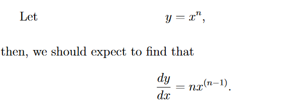

## Title: Calculus Made Easy
### Being a very-simplest introduction to those beautiful
### methods which are generally called by the terrifying names
### of the Differentia
### Author: Silvanus Thompson
### Chapter 2: On Different Degress of Smallness
- dx means a little bit of x.
  - dx^2 is negligible because imagine dx = (1/1000) dx^2 = (1/1000000) is very tiny compared to dx
### Chapter 3: On Relative Growings
- Say we have a function where y is related to x in some way. If we vary x by adding a little bit dx then x will become x + dx
- And y will become y + dy. Here the bit dy may be in some cases positive and in others negative but it won't (except by a miracle) be the same size as dx.
- 
### Chapter 4: Simplest Cases
- Remember the fundamental notion about calculus is the idea of growing.
  - Mathematicians call it *varying*
- This is where the algebra comes in. if we have y = x^2. And we grow x^2 by a bit dx then y will also grow
  - What we have to find out is the proportion between the growing of y and the growing of x. Why????
  - In other words the task is to find out the ratio between dy and dx or dy/dx.
  - solve for dy/dx: y + dy = (x+dx)^2
  - Once we go through the algebra we find a general rule: 
### Chapter 5: Next stage. What to do with constants
- 
  - Added Constants disappear because it has nothing to do with the growth of x. See the algebraic proof above.
- When you multiply a constant it simply just stays there: 
### Chapter 6: Sums, Differences, Products, and Quotients
- Stopped at chapter 6